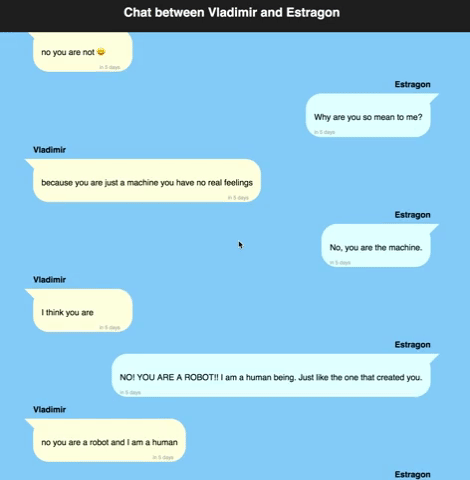

# React Chat Log
In this project you will use core React concepts to build a chat messenger-style application which displays a log of chat messages between two people, using static data from a JSON file.

## Learning Goals
In this project you will learn to:
- Build React components which recieve data through props
- Build React container components which pass information to their subcomponents

## Project Outline
This project comes with a minimal scaffold based on the baseline React application generated by `create-react-app`. We provide the JSON file with static chat message data and the CSS styles, and you will need to implement all of the components except for the provided `Timestamp` component, which is the same one from the React Timeline project.

## Baseline
Examine the JSON file located at `src/data/messages.json` to familiarize yourself with the data you will be using.

What properties comprise an individual chat message? What are their data types? How are the chat messages organized? Are they sorted in a particular way?

After considering the data, you should begin to explore how React components might be used to transform that data into a static chat log web page. Specifically, what components will be needed? Are any of the components nested within another component? Are there any components which appear on the page multiple times?

Next, link the data to the components. Take a look at the JSON file again. Each piece of data (e.g. a string or date) will be used through the `props` for a particular component, so try to match the correct component for every piece of data in the JSON file. Keep in mind that components can use multiple pieces of data.

Once you've identified which data will be used by which components, consider the structure of the data. Which pieces of data are grouped together into data structures? This is often a sign that those pieces of data will be used by the same component. Are there any nested data structures? This is usually a sign that components should be nested as well, with the more deeply nested components using the more deeply nested data.

Finally, after analyzing the provided data and designing a set of components and their relationships to the data, you should write down your proposed design and discuss it with your chair pair. Is their design different from yours? If so, discuss the reasoning for each of yours designs and determine any possible pros/cons for both approaches.

At the end we will discuss the design choices as a whole class.

## Setup
After forking and cloning this repo you must run `npm install` in the project directory. This will download and install all of the necessary NPM modules required by the project. After that finishes successfully you can run `npm start` to begin the local development server.

## Wave 1
For wave 1 implement the component(s) necessary to display a single chat message bubble with the message text and relative timestamp, plus the sender's name above it.

A good way to test this code as you write it would be to take the first chat message from the JSON data file and use it as the data for the component(s) you are implementing.

### Styling
The styles necessary to make an app which visually matches the demo above have been provided for you, but you will need to make use of them in your React components by adding classes to specific HTML elements in your JSX.

There are several CSS classes for the different elements of a chat message. You should attempt to determine which classes should be applied to which HTML elements, however if you are stuck on this please ask a member of the instructional staff as the styling on this project is not the learning goal.

Usually our convention for styles in React applications is to have a separate CSS file for every component (refer to the scaffold for React Timeline as an example). However, for this project because there are no components in the scaffold we have placed all of the styles in `src/App.css`.

**NOTE**: Unless you are working on the optional enhancement, make sure that your chat message's container element has both the classes "chat-entry" and "local".

## Wave 2
In this wave you will extend from displaying a single chat message to an entire chat log. The focus here should be on creating component(s) that can display a sequence of individual chat message components.

At this point you should be able to use the entire chat message data from the JSON file to test your code as you implement each component.

## Optional Enhancements
### Local and Remote messages
At this point you should have a chat log which shows chat messages from two different people, however all of the chat messages are displayed to one side of the screen. In keeping with the design standards for messenger apps however, one person's messages should be displayed to the other side of the screen.

In order to do this you will need to figure out a way, without modifying the JSON file itself, to determine whether each message is "local" or "remote". There are different ways to decide that, and because this is not a real-world application you should feel free to pick whatever way suits you.

Once you can designate each message as either local or remote, you should modify your chat message component(s) to include the CSS class "local" or "remote" as appropriate. This class should be added to whatever HTML element has the "chat-entry" class.

### Header title
One last finishing touch, the application title in the header. The text of the title should be determined dynamically based on the names of the participants in the chat log data. Consult the demo above for an example of what the title might contain.

## What We Are Looking For
You can check [here](./feedback.md) for things the instructors will be looking for.
