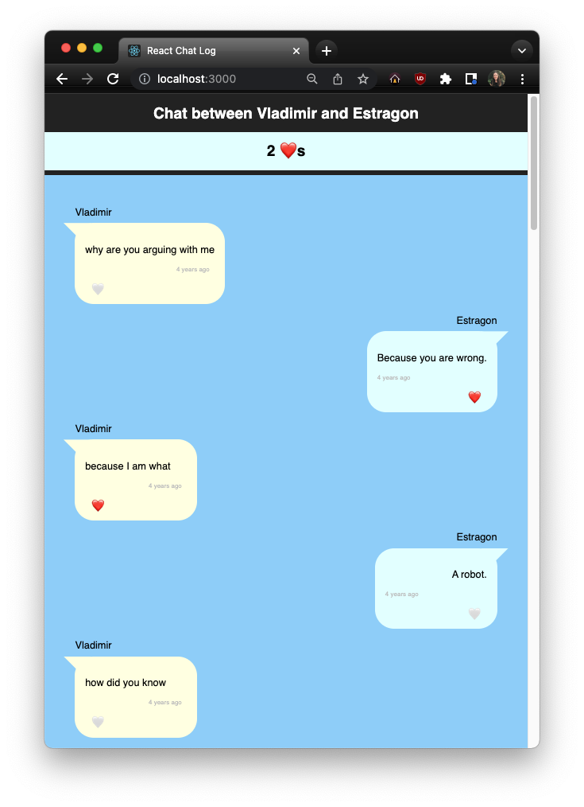

# React Chat Log
In this project we will use core React concepts to build a chat messenger-style application that displays a log of chat messages between two people, using static data from a JSON file. We will build user interaction with a like feature. 

## Skills Assessed
- Building React components that receive data through props
- Building React container components that pass information to their subcomponents
- Initializing and using state within a component
- Passing callback functions to child components and using them to update state
- Practicing reading and running tests
- Using git as part of the development workflow
- Demonstrating understanding of the front-end layer, and the relationship between user interaction and the UI

## Project Outline
This project comes with a minimal scaffold based on the baseline React application generated by `vite`. We provide the JSON file with static chat message data and the CSS styles, and you will need to implement all of the components except for the provided `TimeStamp` component.

## Project Directions
- [Planning and Setup](./project-docs/setup.md)
- [Wave 01: Presentational Component](./project-docs/wave-01.md)
- [Wave 02: Container Component](./project-docs/wave-02.md)
- [Wave 03: Event Handling and Lifting Up State](./project-docs/wave-03.md)
- [Optional Enhancements](./project-docs/optional-enhancements.md)

## Testing

The tests for this project are a mix of unit tests (Waves 01 and 02) and integration tests (Wave 03). The directions for each wave include a section about the tests for that wave. The unit tests provided for Wave 01 and Wave 02 require us to be prescriptive around component and prop names. The integration tests for Wave 03 allow for more freedom in the implementation details of this wave's feature. 

Writing front-end tests is outside the scope of the core curriculum. We provide minimal tests for this project for a few reasons. We can use these tests to partially verify the correctness of our code. Tests support the refactoring process and enforce consistency in implementation details. Additionally, by reviewing these front-end tests, we have some exposure to what unit tests and integration tests look like in front-end testing.

Follow your curiosity to learn more about front-end testing:
- [Front End Testing: A Complete Conceptual Overview](https://www.testim.io/blog/front-end-testing-complete-overview/)
- [React Testing Library](https://testing-library.com/docs/react-testing-library/intro/)

