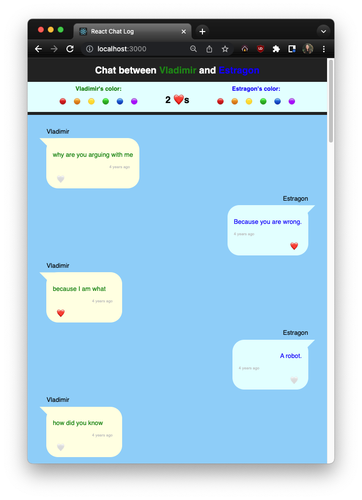

# Optional Enhancements

## Local and Remote messages
At this point you should have a chat log which shows chat messages from two different people, however all of the chat messages are displayed to one side of the screen. In keeping with the design standards for messenger apps however, one person's messages should be displayed to the other side of the screen.

In order to do this you will need to figure out a way, without modifying the JSON file itself, to determine whether each message is "local" or "remote". There are different ways to decide that, and because this is not a real-world application you should feel free to pick whatever way suits you.

Once you can designate each message as either local or remote, you should modify your `ChatEntry` component(s) to include the CSS class "local" or "remote" as appropriate. This class should be added to whatever HTML element has the "chat-entry" class.

## Color Choice
Now that we have designated `ChatEntry`s as `"local"` or `"remote"`, let's add a feature to style the entries from different senders with different colors. Take a look at the image our solution for one suggestion on how to implement a color picking feature. 

### Hints
Our solution uses a `ColorChoice` component with a `setColorCallback` prop that sets the color in the `App`. Once the color in the `App` is set, it is passed as a prop through the `ChatLog` to the `ChatEntry` components.

## Header title
For one last finishing touch, consider updating the application title in the header. The text of the title should be determined dynamically based on the names of the participants in the chat log data. Consult the image of the example solution for what the title might contain.