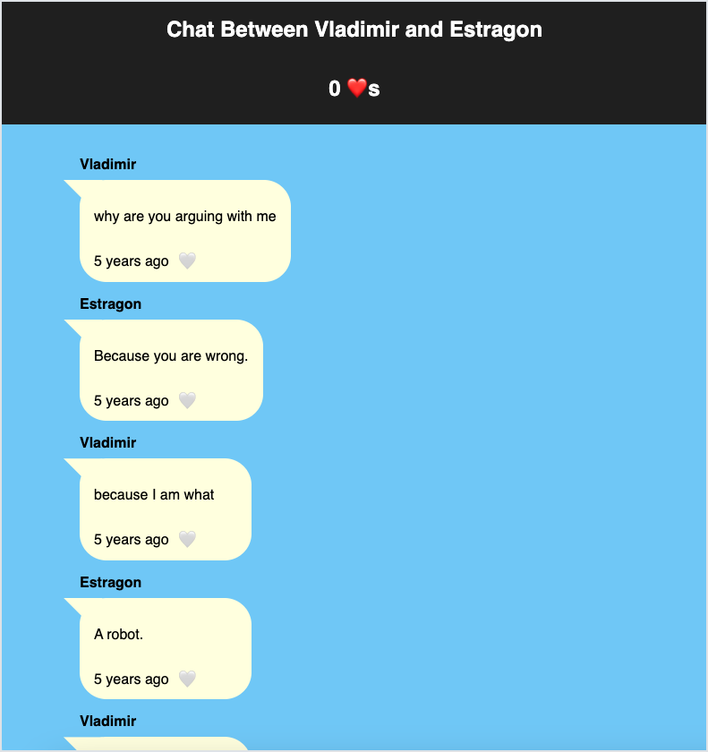

# Wave 02: Container Component

**Learn Topics: React Components and Props required for this wave**

Implement a `ChatLog` component and update the `App` component to display an entire chat log. `ChatLog` should display a sequence of individual `ChatEntry` components.

`ChatLog` takes one prop named `entries` (which is an array).

At this point, we can use the entire chat message data from the JSON file `messages.json` to test our code as you implement each component. We may choose to update the `ChatEntry` to use the `id` field in this wave. At the end of this wave, all messages will be on the left side of the screen. For alternating left and right messages, please follow the instructions found in [optional enhancements](optional-enhancements.md).

## Imports

 Remember to keep track of your imports as you work through the project. More specifically, Wave 02 will use chat messages found in the JSON file [`messages.json`](src/data/messages.json).(Note: The name used in the import will be the variable name that will use to reference the data in our code.)

## Styling

Note the rule set in `ChatLog.css` and consider how to apply it to the `ChatLog` component. Remember, applying the provided styles is not one of the main learning goals for this project.

## Tests

The tests for this component assume that the component is named `ChatLog` and takes one prop named `entries` (which is an array).
